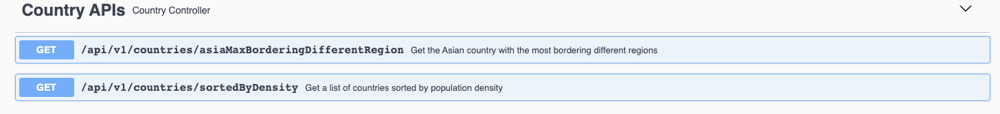

## 📝 Project Description
This project involves fetching and processing data from the [REST Countries API](https://gitlab.com/restcountries/restcountries). The project has two main objectives:
1. Create a sorted list of countries by population density in descending order.
2. Identify the Asian country with the most neighboring countries from a different region.
---
## ⚙️ Installation/Usage
### Requirements
- Docker version 24.0.5, build ced0996

To run the application use Docker:

1. Pull the Docker image: 
```bash
docker pull kristofs577/countries-image:latest
```
2. Once it's pulled, list the images using the docker images command, and save the Image ID:
```bash
IMAGE_ID=$(docker images --format "{{.ID}}" kristofs577/countries-image:latest | head -n 1)
```
3. Run the Docker container:
```bash
docker run -p 8080:8080 -e "SPRING_PROFILES_ACTIVE=prod" $IMAGE_ID
```
---
# API Documentation 🌍📚

## All Controllers 🎮

To explore the API endpoints interactively, you can visit the [Swagger UI](http://localhost:8080/swagger-ui/index.html) after running the application.


## Global Exception Handler 🚫

This handler manages global exceptions for the API.

### Handling NullPointerException

Handles cases when data is not available.

**Response:**
- **HTTP Status Code:** 500
- **Body:** "Data not available."

### Handling DataProcessingException

Handles data processing exceptions.

**Response:**
- **HTTP Status Code:** 500
- **Body:** "An error occurred during data processing."

